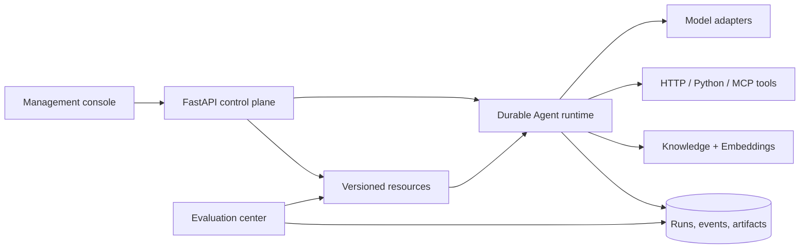

<p align="center">
  
</p>

<h1 align="center">Eivon</h1>

<p align="center"><strong>Build domain agents from versioned capabilities.</strong></p>

<p align="center">
  <a href="README.md">English</a> · <a href="README.zh-CN.md">简体中文</a>
</p>

<p align="center">
  <a href="https://github.com/Lzzyyy123/eivon/actions/workflows/ci.yml"></a>
  <a href="LICENSE"></a>
  <a href="https://www.python.org/downloads/"></a>
</p>

Eivon is a self-hosted, domain-independent agent framework. It provides a control plane for composing models, prompts, tools, skills, knowledge sources and workflows into versioned Agents, then running them through an observable and resumable runtime.

The core does not know whether an Agent serves agriculture, customer support, operations, research or a completely new domain. A vertical implementation lives in resources, Bundles and reviewed extensions. The framework owns the contracts, execution boundary, persistence, approvals, evaluation and management experience.


## Why Eivon

- **Portable domain design** — describe a vertical domain with versioned resources and a Bundle instead of forking the runtime.
- **A control plane, not a prompt demo** — publish immutable releases, inspect Runs, resume waiting work and audit changes.
- **Open integration boundaries** — use OpenAI-compatible models, HTTP tools, Python extensions, MCP tools and MCP knowledge sources.
- **Self-hosted by default** — start with SQLite and the offline demo model; move to PostgreSQL and external providers when needed.
- **Human control where it matters** — write tools, approvals, credentials, workspace permissions and evaluation proposals have explicit boundaries.

## Core concepts

| Concept | Purpose |
| --- | --- |
| **Resource** | A validated Model, Embedding, Prompt, Tool, Skill, Bundle, Workflow, Agent or Connection. |
| **Release** | An immutable resource version with frozen dependency snapshots and digests. |
| **Bundle** | A reusable domain capability pack that groups tools, skills, prompts, workflows and knowledge collections. |
| **Agent** | A model plus instructions, Bundles and an execution policy. |
| **Workflow** | A typed sequence of Input, Tool, Prompt and Condition steps with persistent branching. |
| **Run** | A durable execution with ordered events, checkpoints, approvals, cancellation and recovery. |
| **Evaluation** | Historical test batches, comparison, human review and model-assisted improvement proposals. |



## Quick start

Requirements: Python 3.12+, Node 22+ and, for the browser acceptance suite, a Chromium installation.

```bash
git clone https://github.com/Lzzyyy123/eivon.git
cd eivon
python -m venv .venv
.venv/bin/pip install -e '.[dev]'
cd console && npm ci && npm run build && cd ..
.venv/bin/eivon init
.venv/bin/eivon migrate
.venv/bin/eivon serve --host 127.0.0.1 --port 8787
```

Open <http://127.0.0.1:8787>. The first command creates `var/setup-token`; paste that token into the setup screen. The offline demo model lets you complete the first walkthrough without a provider key.

For PostgreSQL and a production-like container deployment:

```bash
cp .env.example .env
# Set POSTGRES_PASSWORD, EIVON_SECRET_KEY and EIVON_SETUP_TOKEN in .env.
docker compose up --build
```

Before upgrades, create a backup and rehearse restore with the API and workers stopped. See [operations.md](docs/operations.md) for SQLite and PostgreSQL procedures.

## Build your first Agent

1. Complete the setup screen and open **Resources → New resource**.
2. Create and publish a `model` using the offline demo provider.
3. Create and publish a `prompt`.
4. Create an `agent` and select the published model and prompt.
5. Open **Playground**, choose the Agent and send a message.
6. Inspect the ordered trace in **Run history**. If a write tool needs approval, the Run pauses and resumes from the same checkpoint after approval.

The console is only one client. The same flow is available through the FastAPI schema at `/docs` and the `/api/v1` endpoints.

## Build a vertical domain package

Keep domain code outside `eivon.core`. A trusted Python extension can register a domain tool:

```python
from eivon.core.contracts import ExecutionContext, ToolResult

async def lookup_case(arguments: dict, context: ExecutionContext) -> ToolResult:
    case_id = str(arguments.get("case_id", "unknown"))
    # Enforce domain-level authorization before reading a real system.
    return ToolResult(success=True, data={"case_id": case_id, "workspace": context.workspace_id})

def register(registry):
    registry.register_tool("lookup_case", lookup_case)
```

Create a Tool resource for the registered entrypoint, publish it, and compose it into a Bundle or Agent. The Bundle schema is deliberately generic; see the [customer-support](examples/bundles/customer_support.json) and [operations](examples/bundles/operations.json) starters. The [extension guide](docs/extensions.md) explains trusted and process-isolated deployment modes.

## What is included

- Workspace-scoped users, roles, API keys, encrypted credentials and audit events.
- Immutable releases, optimistic draft revisions, dependency validation, comparison, activation rollback and archive/restore.
- Streaming model adapters, tool-call validation, timeouts, result budgets, outbound host allowlists and write approvals.
- Durable Runs with ordered events, cancellation, input/approval waits, resumable checkpoints and worker lease fencing.
- Sessions, conversations, private artifacts and authenticated file downloads.
- Knowledge collections with local or OpenAI-compatible Embeddings, lexical/semantic/hybrid retrieval and HTTP JSON/MCP synchronization.
- Evaluation batches, historical comparison, deterministic scoring, human review and bounded model-generated suggestions.
- A dark management console for setup, resources, Agents, Playground, Workflow Studio, knowledge, Runs, evaluations and workspace administration.
- Docker Compose deployment, SQLite backup/restore, PostgreSQL dump/restore and GitHub Actions checks.

## Documentation

| Topic | Guide |
| --- | --- |
| Architecture and boundaries | [docs/architecture.md](docs/architecture.md) |
| Resource contracts and releases | [docs/resources.md](docs/resources.md) |
| Workflow authoring and execution | [docs/workflows.md](docs/workflows.md) |
| Knowledge and retrieval | [docs/resources.md](docs/resources.md) |
| Extensions and domain packages | [docs/extensions.md](docs/extensions.md) |
| Evaluation and improvement | [docs/evaluations.md](docs/evaluations.md) |
| Workspace administration | [docs/administration.md](docs/administration.md) |
| Operations and backup | [docs/operations.md](docs/operations.md) |
| API surface | [docs/api.md](docs/api.md) |
| Delivery and verification | [docs/DELIVERY.md](docs/DELIVERY.md) |

## Repository layout

```text
src/eivon/       Python contracts, runtime, adapters and FastAPI services
console/         React + Vite management console
examples/        Minimal resource graph, extensions and vertical Bundle starters
tests/           Deterministic backend tests
scripts/         Release checks, browser server, stress and database rehearsal
docs/            Architecture, API, operations and extension guides
```

## Security boundary

Python extensions run with deployment privileges. Process isolation reduces shared process state but is not a complete OS sandbox. Run extension workers with a dedicated user/container and restrict `EIVON_EXTENSIONS` to reviewed modules. HTTP and MCP destinations require explicit outbound host allowlists, and credentials are stored as encrypted references rather than returned from APIs. Read [SECURITY.md](SECURITY.md) before exposing an instance.

## Development

```bash
.venv/bin/pytest -q
.venv/bin/ruff check src tests examples
npm run build --prefix console
```

The full release gate is:

```bash
PYTHONPATH=src .venv/bin/python scripts/check_release.py
```

See [CONTRIBUTING.md](CONTRIBUTING.md) for local conventions and change expectations. Eivon is an evolving foundation release; deployment-specific connectors, model quality and OS-level sandboxing remain the responsibility of each deployment.

## License

Eivon is released under the [Apache License 2.0](LICENSE).
