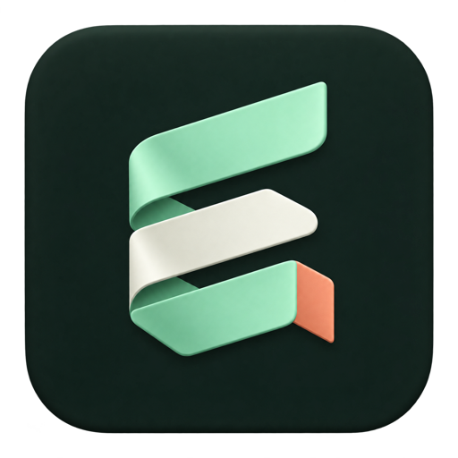
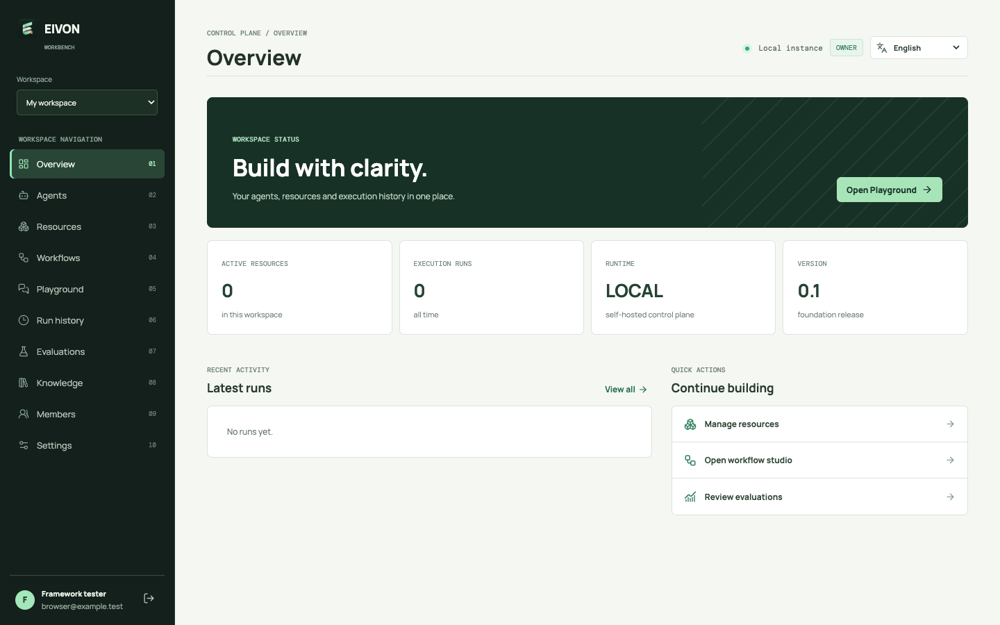
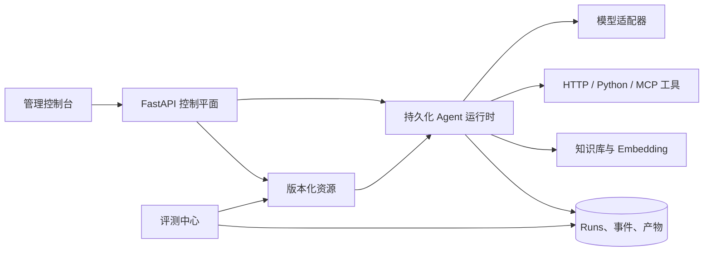

<p align="center">
  
</p>

<h1 align="center">Eivon</h1>

<p align="center"><strong>用可版本化的能力，构建任意垂直领域的智能体。</strong></p>

<p align="center">
  <a href="README.md">English</a> · <a href="README.zh-CN.md">简体中文</a>
</p>

<p align="center">
  <a href="https://github.com/Lzzyyy123/eivon/actions/workflows/ci.yml"></a>
  <a href="LICENSE"></a>
  <a href="https://www.python.org/downloads/"></a>
</p>

Eivon 是一个自托管、与业务领域无关的智能体框架。它提供一套控制平面，把模型、提示词、工具、技能、知识源和工作流组合成可版本化的 Agent，再通过可观测、可恢复的运行时执行它们。

核心不关心 Agent 服务的是农业、客服、运维、研究，还是一个全新的领域。垂直业务应该沉淀在资源、Bundle 和经过审核的扩展中；框架负责契约、执行边界、持久化、审批、评测和管理体验。



## 为什么选择 Eivon

- **业务可移植**：用版本化资源和 Bundle 描述垂直领域，不需要复制运行时。
- **完整控制平面**：支持不可变发布、运行检查、等待恢复和审计，不只是一个 Prompt Demo。
- **开放集成边界**：支持 OpenAI 兼容模型、HTTP 工具、Python 扩展、MCP 工具和 MCP 知识源。
- **默认自托管**：SQLite 和离线 Demo 模型可以零外部服务启动，需要时再切换到 PostgreSQL 和真实模型。
- **关键动作有人控制**：写操作、审批、凭据、工作区权限和评测改进都有明确边界。

## 核心概念

| 概念 | 作用 |
| --- | --- |
| **Resource** | 经过校验的 Model、Embedding、Prompt、Tool、Skill、Bundle、Workflow、Agent 或 Connection。 |
| **Release** | 带有依赖快照和摘要的不可变资源版本。 |
| **Bundle** | 可复用的业务能力包，组合工具、技能、提示词、工作流和知识集合。 |
| **Agent** | 模型、指令、Bundle 和执行策略的组合。 |
| **Workflow** | 由 Input、Tool、Prompt、Condition 组成的类型化流程，支持持久化分支。 |
| **Run** | 带有有序事件、检查点、审批、取消和恢复能力的一次持久化执行。 |
| **Evaluation** | 历史测试批次、版本比较、人工评审和模型辅助改进。 |



## 快速启动

要求：Python 3.12+、Node 22+；运行浏览器验收测试还需要 Chromium。

```bash
git clone https://github.com/Lzzyyy123/eivon.git
cd eivon
python -m venv .venv
.venv/bin/pip install -e '.[dev]'
cd console && npm ci && npm run build && cd ..
.venv/bin/eivon init
.venv/bin/eivon migrate
.venv/bin/eivon serve --host 127.0.0.1 --port 8787
```

打开 <http://127.0.0.1:8787>。初始化会生成 `var/setup-token`，把这个 Token 粘贴到设置页面即可。离线 Demo 模型可以让你在没有模型 API Key 的情况下完成第一次体验。

管理控制台支持英文和简体中文，可通过顶部语言切换器或“设置”页面切换；浏览器会记住你的选择。

使用 PostgreSQL 和接近生产的容器部署：

```bash
cp .env.example .env
# 在 .env 中设置 POSTGRES_PASSWORD、EIVON_SECRET_KEY 和 EIVON_SETUP_TOKEN。
docker compose up --build
```

升级前请先备份，并在 API 和 Worker 停止时演练恢复流程。具体步骤见[运维文档](docs/operations.md)。

## 创建第一个 Agent

1. 完成初始化，进入 **Resources → New resource**。
2. 创建并发布一个使用离线 Demo Provider 的 `model`。
3. 创建并发布一个 `prompt`。
4. 创建 `agent`，选择刚发布的模型和提示词。
5. 打开 **Playground**，选择 Agent 并发送消息。
6. 在 **Run history** 查看有序执行轨迹。如果写工具需要审批，Run 会在检查点暂停，审批后从原位置恢复。

控制台只是一个客户端；同样的流程也可以通过 `/docs` 中的 FastAPI Schema 和 `/api/v1` 接口完成。

## 构建一个垂直领域包

把业务代码放在 `eivon.core` 之外。可信 Python 扩展可以注册一个领域工具：

```python
from eivon.core.contracts import ExecutionContext, ToolResult

async def lookup_case(arguments: dict, context: ExecutionContext) -> ToolResult:
    case_id = str(arguments.get("case_id", "unknown"))
    # 访问真实系统前，必须执行领域级授权。
    return ToolResult(success=True, data={"case_id": case_id, "workspace": context.workspace_id})

def register(registry):
    registry.register_tool("lookup_case", lookup_case)
```

为注册的入口创建 Tool 资源并发布，再把它组合到 Bundle 或 Agent 中。Bundle Schema 有意保持通用，可以参考 [客服示例](examples/bundles/customer_support.json) 和[运维示例](examples/bundles/operations.json)。[扩展文档](docs/extensions.md)介绍了可信模式和进程隔离模式。

## 已包含能力

- 工作区隔离的用户、角色、API Key、加密凭据和审计事件。
- 不可变发布、草稿乐观并发、依赖校验、版本比较、激活回滚和归档恢复。
- 流式模型适配器、工具调用校验、超时、结果预算、出站主机白名单和写操作审批。
- 带有有序事件、取消、输入/审批等待、可恢复检查点和 Worker 租约防重的持久化 Run。
- Sessions、Conversations、私有 Artifact 和鉴权文件下载。
- 支持本地或 OpenAI 兼容 Embedding 的知识集合、词法/语义/混合检索，以及 HTTP JSON/MCP 同步。
- 评测批次、历史比较、确定性评分、人工评审和有边界的模型生成建议。
- 暗色管理控制台：初始化、资源、Agent、Playground、Workflow Studio、知识库、Runs、评测和工作区管理。
- Docker Compose、SQLite 备份恢复、PostgreSQL 导入导出以及 GitHub Actions 检查。

## 文档

| 主题 | 文档 |
| --- | --- |
| 架构与边界 | [docs/architecture.md](docs/architecture.md) |
| 资源契约与发布 | [docs/resources.md](docs/resources.md) |
| 工作流编排与执行 | [docs/workflows.md](docs/workflows.md) |
| 知识库与检索 | [docs/resources.md](docs/resources.md) |
| 扩展与领域包 | [docs/extensions.md](docs/extensions.md) |
| 评测与改进 | [docs/evaluations.md](docs/evaluations.md) |
| 工作区管理 | [docs/administration.md](docs/administration.md) |
| 运维与备份 | [docs/operations.md](docs/operations.md) |
| API | [docs/api.md](docs/api.md) |
| 交付与验证 | [docs/DELIVERY.md](docs/DELIVERY.md) |

## 仓库结构

```text
src/eivon/       Python 契约、运行时、适配器和 FastAPI 服务
console/         React + Vite 管理控制台
examples/        最小资源图、扩展模块和垂直 Bundle 示例
tests/           确定性后端测试
scripts/         发布检查、浏览器服务、压力测试和数据库演练
docs/            架构、API、运维和扩展文档
```

## 安全边界

Python 扩展拥有部署环境的权限。进程隔离可以减少共享进程状态，但不是完整的操作系统沙箱；应使用专用用户/容器运行扩展 Worker，并只允许审核过的 `EIVON_EXTENSIONS`。HTTP 和 MCP 目的地必须通过出站主机白名单，凭据以加密引用存储，API 不会返回明文。对外暴露实例前请阅读 [SECURITY.md](SECURITY.md)。

## 开发

```bash
.venv/bin/pytest -q
.venv/bin/ruff check src tests examples
npm run build --prefix console
```

完整发布门禁：

```bash
PYTHONPATH=src .venv/bin/python scripts/check_release.py
```

本地规范和变更要求见 [CONTRIBUTING.md](CONTRIBUTING.md)。Eivon 目前是持续演进的基础版本；具体部署的连接器、模型质量和操作系统级沙箱由部署方负责。

## 许可证

Eivon 使用 [Apache License 2.0](LICENSE) 发布。
